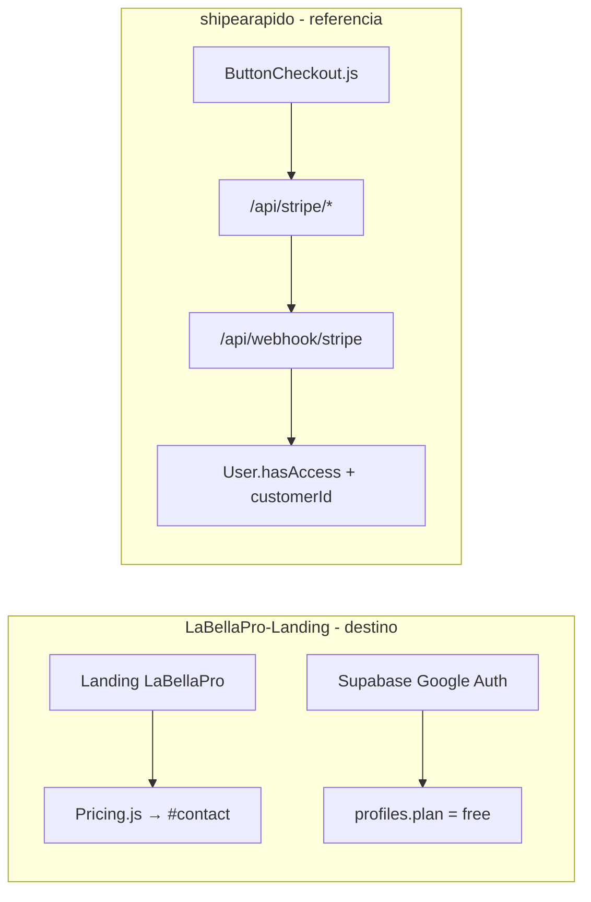
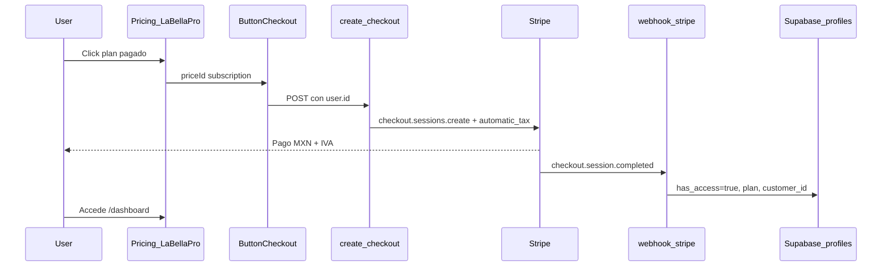

# Migración Stripe: ShipFast → LaBellaPro

Guía paso a paso para integrar pagos con Stripe en **LaBellaPro-Landing** (LaBellaPro), usando [`shipearapido`](../shipearapido) como referencia de implementación y la [documentación oficial de ShipFast](https://shipfa.st/docs) como contexto.

**Decisión de arquitectura confirmada:**

- **Destino:** `LaBellaPro-Landing/web` — mantener Supabase Auth + frontend LaBellaPro existente.
- **Referencia:** `shipearapido` — copiar/adaptar la lógica Stripe (checkout, portal, webhook).
- **Modelo de cobro:** suscripción mensual en **MXN**, precios en landing **sin IVA**; Stripe Tax calcula y cobra el **IVA 16%** en checkout.
- **Orden de ejecución:** frontend primero → API → base de datos → paywall → pruebas → producción.

---

## Inventario: qué ya tienes vs qué falta



| Área | LaBellaPro-Landing (ya funciona) | shipearapido (referencia Stripe) |
|------|--------------------------------|----------------------------------|
| Landing + pricing UI | `web/components/landing/Pricing.js` — CTAs a `#contact` | `components/Pricing.js` + `components/ButtonCheckout.js` |
| Auth | Supabase Google OAuth | NextAuth + MongoDB |
| Pagos | `features.payments: false`, sin SDK Stripe | Checkout + portal + webhook completos |
| Planes | MXN mensual en `web/config.js` | USD placeholder en `config.js` |
| Base de datos | `profiles.plan` en `supabase/migrations/001_auth_profiles.sql` | `User.hasAccess`, `customerId`, `priceId` |

### Lo que NO migrar

- NextAuth, MongoDB, Mongoose models de shipearapido.
- Componentes marketing genéricos de ShipFast (Hero, FAQ, etc.) — LaBellaPro ya tiene los suyos.
- Catalyst admin shell de shipearapido (opcional futuro).

---

## Flujo objetivo (post-migración)



---

## Fase 0 — Prerrequisitos (Stripe Dashboard)

Completar antes de escribir código de pagos.

### 0.1 Cuenta y modo test

- [ ] Crear cuenta en [Stripe Dashboard](https://dashboard.stripe.com).
- [ ] Activar **modo test** (toggle arriba a la derecha).
- [ ] Instalar [Stripe CLI](https://stripe.com/docs/stripe-cli) para pruebas locales.

### 0.2 Productos y precios (MXN, recurrentes)

Crear **3 productos** con precio **recurrente mensual** en pesos mexicanos:

| Plan LaBellaPro | Precio sin IVA | Intervalo | Notas |
|-----------------|----------------|-----------|-------|
| Emprendedor | $400 MXN | mensual | 1 salón, 2 usuarios |
| Creciendo el Negocio | $580 MXN | mensual | Plan destacado |
| Premium | $930 MXN | mensual | Por salón/sucursal |

- [ ] Producto + Price creado: **Emprendedor** → copiar `price_...` (test).
- [ ] Producto + Price creado: **Creciendo el Negocio** → copiar `price_...` (test).
- [ ] Producto + Price creado: **Premium** → copiar `price_...` (test).
- [ ] Repetir en **modo live** cuando vayas a producción (Price IDs distintos).

> **Importante (ShipFast):** el webhook compara el `priceId` del checkout contra `config.stripe.plans`. Si no coinciden, **el cliente paga y nunca recibe acceso**.

### 0.3 IVA (Stripe Tax)

Precios en la landing = **sin IVA** (`taxDisclaimer` ya dice: *"Estos precios no incluyen IVA."*).

- [ ] Activar [Stripe Tax](https://dashboard.stripe.com/tax) en el Dashboard.
- [ ] Registrar tu negocio en México (RFC, régimen fiscal).
- [ ] En checkout, habilitar `automatic_tax: { enabled: true }` (ver Fase 2).
- [ ] Probar que el recibo de test muestra subtotal + IVA 16%.

### 0.4 Customer Portal

- [ ] Ir a **Settings → Billing → Customer portal**.
- [ ] Activar portal: cancelar suscripción, cambiar método de pago, ver facturas.
- [ ] Configurar URL de retorno (ej. `https://tu-dominio.com/dashboard`).

### 0.5 Variables de entorno

Añadir a `web/.env.example` y rellenar en `web/.env.local`:

```bash
# --- Stripe ---
STRIPE_SECRET_KEY=sk_test_...
STRIPE_WEBHOOK_SECRET=whsec_...          # local: stripe listen --print-secret
NEXT_PUBLIC_STRIPE_PUBLISHABLE_KEY=pk_test_...
```

- [ ] `STRIPE_SECRET_KEY` configurada (test).
- [ ] `STRIPE_WEBHOOK_SECRET` configurada (local con CLI o endpoint en Dashboard).
- [ ] `NEXT_PUBLIC_STRIPE_PUBLISHABLE_KEY` configurada (si usas Elements en el futuro).

### 0.6 Dependencia npm

En `web/`:

```bash
yarn add stripe
```

- [ ] Paquete `stripe` instalado en `web/package.json`.

---

## Fase 1 — Frontend (empezar aquí)

Objetivo: conectar la UI de LaBellaPro al flujo de checkout sin romper lo que ya funciona cuando `features.payments === false`.

> **Nota:** en esta fase los botones pueden fallar con 404/501 hasta que existan las API routes (Fase 2). Puedes probar la UI con `features.payments: false` y activar cuando el backend esté listo.

### 1.1 Extender `web/config.js`

- [ ] Mantener `features.pricing: true` (vitrina de planes).
- [ ] Dejar `features.payments: false` hasta terminar Fase 2–3; luego activar.
- [ ] Añadir bloque `stripe` con planes mapeados a Price IDs de Stripe:

```javascript
stripe: {
  plans: [
    {
      planId: "emprendedor",
      priceId:
        process.env.NODE_ENV === "development"
          ? "price_DEV_EMPRENDEDOR_CHANGE_ME"
          : "price_PROD_EMPRENDEDOR_CHANGE_ME",
      mode: "subscription",
      name: "Emprendedor",
    },
    {
      planId: "creciendo",
      priceId:
        process.env.NODE_ENV === "development"
          ? "price_DEV_CRECIENDO_CHANGE_ME"
          : "price_PROD_CRECIENDO_CHANGE_ME",
      mode: "subscription",
      name: "Creciendo el Negocio",
      isFeatured: true,
    },
    {
      planId: "premium",
      priceId:
        process.env.NODE_ENV === "development"
          ? "price_DEV_PREMIUM_CHANGE_ME"
          : "price_PROD_PREMIUM_CHANGE_ME",
      mode: "subscription",
      name: "Premium",
    },
  ],
},
```

- [ ] En `pricing.plans[]`, añadir `stripePriceId` a cada plan pagado (o derivarlo de `stripe.plans` por `planId`).
- [ ] Plan **Demo** (`id: "demo"`): **sin Stripe** — flujo `#contact` o `/login` con trial manual.
- [ ] Confirmar que `taxDisclaimer` sigue visible bajo la tabla de precios.

**Helper sugerido** (opcional en config o util):

```javascript
// Dado plan.id, devuelve el priceId de Stripe o null (demo)
export function getStripePriceId(planId) {
  return config.stripe?.plans?.find((p) => p.planId === planId)?.priceId ?? null
}
```

### 1.2 Cliente API frontend

LaBellaPro-Landing no tiene `libs/api.js` como shipearapido. Crear uno mínimo:

**Archivo:** `web/lib/api-client.js`

- [ ] Crear wrapper `fetch` hacia `/api/*` con manejo de errores JSON.
- [ ] En 401, redirigir a `config.auth.loginUrl` (`/login`).
- [ ] Opcional: añadir `react-hot-toast` para errores (como shipearapido) o usar `alert` en dev.

Referencia: `shipearapido/libs/api.js`.

### 1.3 Crear `web/components/payments/ButtonCheckout.js`

Portar desde `shipearapido/components/ButtonCheckout.js` con estas adaptaciones:

| ShipFast (shipearapido) | LaBellaPro (LaBellaPro-Landing) |
|-------------------------|--------------------------------|
| `mode = "payment"` default | `mode = "subscription"` default |
| `btn btn-primary btn-block` | Clases doradas de Pricing (ver abajo) |
| Texto "Get {appName}" | Prop `label` desde `plan.cta` |
| `apiClient` de `@/libs/api` | `apiClient` de `@/lib/api-client` |

- [ ] Componente creado como `"use client"`.
- [ ] Props: `priceId`, `mode`, `label`, `highlighted` (estilo).
- [ ] POST a `/api/stripe/create-checkout` con `{ priceId, mode, successUrl, cancelUrl }`.
- [ ] `successUrl`: `${window.location.origin}/dashboard?checkout=success`
- [ ] `cancelUrl`: `${window.location.origin}/#pricing`
- [ ] Estado loading (spinner) mientras redirige a Stripe.

**Clases CSS sugeridas** (copiar de `Pricing.js`):

```javascript
const base =
  "inline-flex w-full items-center justify-center rounded-full px-5 py-3 text-sm font-semibold transition-all duration-200"
const highlighted =
  "mt-8 bg-[#D4AF37] text-gray-900 hover:bg-[#C89F21]"
const normal =
  "mt-8 border border-[#CDAA28] text-[#111827] hover:border-[#D4AF37] hover:bg-[#FFF9EB]"
```

### 1.4 Actualizar `web/components/landing/Pricing.js`

Archivo actual: todos los CTAs van a `#contact`.

- [ ] Importar `ButtonCheckout` y `config`.
- [ ] Por cada plan en `plans.map()`:
  - **Demo** (`id === "demo"`): mantener `<Link href="#contact">` o `<Link href="/login">`.
  - **Planes pagados** + `config.features.payments === true`: renderizar `<ButtonCheckout priceId={...} label={plan.cta} highlighted={plan.highlighted} />`.
  - **Fallback** (`payments === false`): mantener `<Link href="#contact">` (comportamiento actual).
- [ ] Si el usuario no está logueado al hacer checkout, redirigir a login antes o dejar que Stripe pida email (ShipFast permite checkout sin auth; el webhook resuelve por email).

### 1.5 Actualizar CTAs globales

- [ ] `web/components/landing/Hero.js` — CTA principal puede seguir a `#contact` (demo) o `#pricing` (ver planes).
- [ ] `web/components/landing/FinalCta.js` — enlazar a `#pricing` en lugar de solo `#contact` si quieres empujar suscripción.
- [ ] Revisar copy: "Sin tarjeta" aplica al plan Demo, no a planes pagados.

### 1.6 Menú de usuario — Administrar suscripción

Archivo: `web/components/auth/UserMenu.js`

Referencia: `shipearapido/app/(private)/(user)/dashboard/UserShell.js` (función `openBillingPortal`).

- [ ] Convertir a Client Component o extraer subcomponente `BillingMenuItem`.
- [ ] Añadir ítem **"Administrar suscripción"** que POSTee a `/api/stripe/create-portal` con `{ returnUrl: window.location.href }`.
- [ ] Mostrar solo si el perfil tiene `stripe_customer_id` (pasar prop desde layout o fetch perfil).
- [ ] Mensaje amigable si aún no tiene suscripción: "Contrata un plan primero".

### 1.7 Página post-checkout (opcional)

- [ ] En `web/app/(app)/dashboard/page.js`, detectar `searchParams.checkout === "success"`.
- [ ] Mostrar banner: "¡Pago recibido! Tu acceso se activará en unos segundos." (webhook async).
- [ ] Ocultar banner tras unos segundos o al confirmar `has_access`.

### 1.8 Checklist visual antes de backend

- [ ] Landing se ve igual con `payments: false`.
- [ ] Con `payments: true`, botones de planes pagados muestran loading al click.
- [ ] Plan Demo no muestra botón de Stripe.
- [ ] Estilos dorados LaBellaPro consistentes con la tabla de precios.

---

## Fase 2 — Capa API (port desde shipearapido)

Adaptar la lógica de shipearapido reemplazando **NextAuth + MongoDB** por **Supabase**.

### Mapa de archivos

| Nuevo en LaBellaPro-Landing | Basado en shipearapido |
|----------------------------|------------------------|
| `web/lib/stripe.js` | `libs/stripe.js` |
| `web/app/api/stripe/create-checkout/route.js` | `app/api/stripe/create-checkout/route.js` |
| `web/app/api/stripe/create-portal/route.js` | `app/api/stripe/create-portal/route.js` |
| `web/app/api/webhooks/stripe/route.js` | `app/api/webhook/stripe/route.js` |

### 2.1 `web/lib/stripe.js`

- [ ] Copiar `createCheckout`, `createCustomerPortal`, `findCheckoutSession` de shipearapido.
- [ ] En `createCheckout`, añadir **`automatic_tax: { enabled: true }`** al `stripe.checkout.sessions.create`.
- [ ] Mantener: `allow_promotion_codes`, `tax_id_collection`, `client_reference_id`.
- [ ] Para suscripciones: no usar `customer_creation: "always"` en mode subscription (Stripe lo maneja distinto); revisar [docs Stripe Checkout subscription](https://docs.stripe.com/billing/subscriptions/build-subscriptions).

**Diff clave vs shipearapido:**

```javascript
const stripeSession = await stripe.checkout.sessions.create({
  mode,
  automatic_tax: { enabled: true },  // ← NUEVO: IVA México
  allow_promotion_codes: true,
  client_reference_id: clientReferenceId,
  line_items: [{ price: priceId, quantity: 1 }],
  success_url: successUrl,
  cancel_url: cancelUrl,
  // ...extraParams (customer, email, etc.)
})
```

### 2.2 `web/app/api/stripe/create-checkout/route.js`

Adaptaciones respecto a shipearapido:

| shipearapido | LaBellaPro-Landing |
|--------------|-------------------|
| `auth()` NextAuth | `getUser()` de `web/lib/supabase/server.js` |
| `User.findById(session.user.id)` | Query `profiles` por `user.id` |
| `clientReferenceId: user._id` | `clientReferenceId: user.id` (UUID Supabase) |
| `user.customerId` | `profile.stripe_customer_id` |

- [ ] Validar body: `priceId`, `mode`, `successUrl`, `cancelUrl`.
- [ ] Opcional: exigir login (`401` si no hay user) — recomendado para LaBellaPro.
- [ ] Pasar email del user a Stripe para prefill.
- [ ] Retornar `{ url: stripeSessionURL }`.

### 2.3 `web/app/api/stripe/create-portal/route.js`

- [ ] Requerir sesión Supabase (`getUser()`).
- [ ] Leer `stripe_customer_id` del perfil.
- [ ] Si no existe: `400` — "Contrata un plan primero".
- [ ] Llamar `createCustomerPortal({ customerId, returnUrl })`.
- [ ] Retornar `{ url }`.

### 2.4 `web/app/api/webhooks/stripe/route.js`

- [ ] Verificar firma con `STRIPE_WEBHOOK_SECRET`.
- [ ] Usar **Supabase service role** (`createClient` con `SUPABASE_SERVICE_ROLE_KEY`) para actualizar `profiles`.
- [ ] Función helper: `findPlanByPriceId(priceId)` → busca en `config.stripe.plans`.

**Eventos a manejar:**

| Evento | Acción en `profiles` |
|--------|------------------------|
| `checkout.session.completed` | `has_access=true`, `stripe_customer_id`, `stripe_price_id`, `plan=planId`, `subscription_status='active'` |
| `customer.subscription.updated` | Actualizar `subscription_status`, `stripe_price_id` si cambió plan |
| `customer.subscription.deleted` | `has_access=false`, `subscription_status='canceled'` |
| `invoice.paid` | Reconfirmar `has_access=true` si `priceId` coincide |
| `invoice.payment_failed` | Opcional: `subscription_status='past_due'` (no revocar de inmediato) |

**Resolución de usuario en webhook:**

1. Por `client_reference_id` (= `auth.users.id` / `profiles.id`).
2. Fallback: buscar por email del customer Stripe.
3. Si no existe: log error + `500` para que Stripe reintente.

**Snippet de update (pseudocódigo):**

```javascript
await supabaseAdmin
  .from("profiles")
  .update({
    has_access: true,
    stripe_customer_id: customerId,
    stripe_price_id: priceId,
    plan: plan.planId,
    subscription_status: "active",
  })
  .eq("id", userId)
```

- [ ] Webhook route creado y exporta solo `POST`.
- [ ] Body leído como texto (`req.text()`) — requerido por Stripe.
- [ ] No usar `connectMongo` ni modelos Mongoose.

### 2.5 Checklist API

- [ ] `POST /api/stripe/create-checkout` responde `{ url }` en test.
- [ ] `POST /api/stripe/create-portal` responde 401 sin sesión.
- [ ] Webhook responde 400 con firma inválida.
- [ ] Logs claros en errores (sin filtrar secret keys).

---

## Fase 3 — Base de datos (Supabase)

### 3.1 Nueva migración

**Archivo:** `supabase/migrations/009_stripe_billing.sql`

```sql
-- Campos de facturación Stripe en profiles
alter table public.profiles
  add column if not exists stripe_customer_id text,
  add column if not exists stripe_price_id text,
  add column if not exists subscription_status text not null default 'none',
  add column if not exists has_access boolean not null default false,
  add column if not exists trial_ends_at timestamptz;

comment on column public.profiles.stripe_customer_id is 'Stripe Customer ID (cus_...)';
comment on column public.profiles.stripe_price_id is 'Stripe Price ID activo (price_...)';
comment on column public.profiles.subscription_status is 'none | active | past_due | canceled | trialing';
comment on column public.profiles.has_access is 'Acceso al producto — actualizado por webhook';
comment on column public.profiles.trial_ends_at is 'Fin del trial Demo (sin Stripe)';

-- Índice para webhook (buscar por customer)
create index if not exists profiles_stripe_customer_id_idx
  on public.profiles (stripe_customer_id)
  where stripe_customer_id is not null;
```

- [ ] Migración creada.
- [ ] Aplicada en local: `supabase db push` o `supabase migration up`.
- [ ] Aplicada en proyecto remoto `jwbtuqaawaouwerdigdy`.

### 3.2 RLS

- [ ] Usuario autenticado puede **SELECT** su propio perfil (incluidos campos stripe).
- [ ] Usuario **no** puede UPDATE `has_access` ni campos stripe (solo service role / webhook).
- [ ] Webhook usa `SUPABASE_SERVICE_ROLE_KEY` (bypass RLS).

### 3.3 Plan Demo (sin Stripe)

- [ ] Al registrarse por Demo/contacto: `plan = 'demo'`, `trial_ends_at = now() + interval '14 days'`, `has_access = true`.
- [ ] Implementar en trigger `handle_new_user` o en flujo post-login manual.
- [ ] Job/cron futuro: revocar acceso cuando `trial_ends_at < now()` y no hay suscripción activa.

---

## Fase 4 — Paywall y control de acceso

### 4.1 Helper de acceso

**Archivo:** `web/lib/billing/hasAccess.js`

```javascript
export function hasAccess(profile) {
  if (!profile) return false
  if (profile.has_access) return true
  // Trial Demo
  if (profile.plan === "demo" && profile.trial_ends_at) {
    return new Date(profile.trial_ends_at) > new Date()
  }
  return false
}

export function getPlanLimits(planId) {
  // Mapear límites de comparisonTable (profesionistas, usuarios, salones)
  return config.pricing.planLimits?.[planId] ?? {}
}
```

- [ ] Helper creado.
- [ ] Tests manuales con perfil mock.

### 4.2 Gate en zona privada

Opciones (elegir una):

**A) Layout server** — `web/app/(app)/layout.js`:
- [ ] Cargar perfil completo con `supabase.from('profiles').select('*').single()`.
- [ ] Si `!hasAccess(profile)` → redirect a `/#pricing` o página `/subscribe`.

**B) Middleware** — `web/middleware.js`:
- [ ] Añadir chequeo de plan (más costoso; requiere fetch perfil en edge).

Recomendación: **opción A** (layout server) — más simple con Supabase SSR.

### 4.3 Feature gating por plan

- [ ] Mapear límites de `comparisonTable` a constantes en config.
- [ ] En dashboard futuro (agenda, inventario): verificar plan antes de mostrar módulo.
- [ ] Por ahora: gate global "¿tiene acceso?" es suficiente para MVP Stripe.

### 4.4 Sincronizar `features.payments`

- [ ] Cuando todo funcione: `features.payments: true` en `config.js`.
- [ ] Documentar en README del proyecto.

---

## Fase 5 — Pruebas locales

### 5.1 Stripe CLI

Terminal 1 — app:

```bash
cd web
yarn dev
```

Terminal 2 — webhook forwarding:

```bash
stripe listen --forward-to localhost:3000/api/webhooks/stripe
```

Copiar el `whsec_...` que imprime CLI a `STRIPE_WEBHOOK_SECRET` en `.env.local`.

### 5.2 Flujo feliz (tarjeta test)

- [ ] Abrir landing → plan **Creciendo** → checkout.
- [ ] Tarjeta test: `4242 4242 4242 4242`, fecha futura, CVC cualquiera.
- [ ] Verificar en Stripe Dashboard: Payment + Subscription creados.
- [ ] Verificar webhook recibido (200).
- [ ] Verificar en Supabase: `profiles.has_access = true`, `plan = 'creciendo'`.
- [ ] Acceder a `/dashboard` sin redirect a pricing.
- [ ] Verificar **IVA 16%** en el total del checkout Stripe.

### 5.3 Customer Portal

- [ ] Login → UserMenu → "Administrar suscripción".
- [ ] Portal abre en Stripe.
- [ ] Cancelar suscripción → webhook `customer.subscription.deleted` → `has_access = false`.

### 5.4 Casos borde

- [ ] Checkout sin login (si lo permites) → webhook resuelve por email.
- [ ] Price ID incorrecto en config → usuario paga, webhook no encuentra plan → **no access** (bug crítico a detectar).
- [ ] Webhook con firma inválida → 400.
- [ ] Pago fallido (`4000 0000 0000 0002`) → no activar acceso.

---

## Fase 6 — Producción

### 6.1 Stripe live

- [ ] Cambiar a **modo live** en Stripe Dashboard.
- [ ] Crear productos/precios live (MXN mensual).
- [ ] Actualizar `price_PROD_*` en `config.js`.
- [ ] Activar Stripe Tax en live con datos fiscales reales.

### 6.2 Vercel / deploy

- [ ] Variables de entorno en Vercel: `STRIPE_SECRET_KEY`, `STRIPE_WEBHOOK_SECRET`, `NEXT_PUBLIC_STRIPE_PUBLISHABLE_KEY`.
- [ ] Endpoint webhook en Stripe Dashboard: `https://tu-dominio.com/api/webhooks/stripe`.
- [ ] Eventos suscritos: `checkout.session.completed`, `customer.subscription.*`, `invoice.paid`, `invoice.payment_failed`.

### 6.3 Pre-launch checklist

- [ ] `features.payments: true`
- [ ] Price IDs prod verificados contra webhook
- [ ] IVA visible en checkout live (prueba con monto mínimo)
- [ ] Customer Portal configurado con URL prod
- [ ] Emails transaccionales (Resend): opcional confirmación post-compra
- [ ] Aviso de privacidad / términos (footer aún apunta a `#`)

---

## Anexo A — Mapa de archivos completo

| shipearapido | LaBellaPro-Landing | Acción |
|--------------|-------------------|--------|
| `config.js` → `stripe.plans` | `web/config.js` | Adaptar + MXN + planIds LaBellaPro |
| `components/ButtonCheckout.js` | `web/components/payments/ButtonCheckout.js` | Copiar + estilos LaBellaPro |
| `components/Pricing.js` | `web/components/landing/Pricing.js` | Ya existe — solo cambiar CTAs |
| `libs/api.js` | `web/lib/api-client.js` | Crear (fetch wrapper) |
| `libs/stripe.js` | `web/lib/stripe.js` | Copiar + `automatic_tax` |
| `app/api/stripe/create-checkout/route.js` | `web/app/api/stripe/create-checkout/route.js` | Adaptar Supabase |
| `app/api/stripe/create-portal/route.js` | `web/app/api/stripe/create-portal/route.js` | Adaptar Supabase |
| `app/api/webhook/stripe/route.js` | `web/app/api/webhooks/stripe/route.js` | Adaptar Supabase |
| `models/User.js` | `supabase/migrations/009_stripe_billing.sql` | Campos en profiles |
| `libs/auth.js` (NextAuth) | `web/lib/supabase/server.js` | Ya existe — no tocar |
| `UserShell.js` (billing) | `web/components/auth/UserMenu.js` | Añadir portal |
| `.env.example` | `web/.env.example` | Añadir vars Stripe |

---

## Anexo B — IVA en detalle

| Dónde | Qué muestra |
|-------|-------------|
| Landing (`Pricing.js`) | Precio **sin IVA** + disclaimer |
| Stripe Checkout | Subtotal + **IVA 16%** + total |
| Factura Stripe | Desglose fiscal (requiere Stripe Tax + RFC) |

Configuración recomendada:

1. Precios en Stripe = mismo monto que landing (400, 580, 930 MXN).
2. `automatic_tax: { enabled: true }` en checkout session.
3. `tax_id_collection: { enabled: true }` para RFC en checkout B2B (opcional).

---

## Anexo C — Estado de avance

Marca conforme avances:

### Fase 0 — Prerrequisitos
- [ ] Stripe account + productos test
- [ ] Stripe Tax configurado
- [ ] Customer Portal activo
- [ ] Env vars + `yarn add stripe`

### Fase 1 — Frontend
- [ ] config.js extendido
- [ ] api-client.js
- [ ] ButtonCheckout.js
- [ ] Pricing.js actualizado
- [ ] Hero / FinalCta revisados
- [ ] UserMenu + billing portal
- [ ] Banner post-checkout

### Fase 2 — API
- [ ] lib/stripe.js
- [ ] create-checkout route
- [ ] create-portal route
- [ ] webhooks/stripe route

### Fase 3 — Base de datos
- [ ] Migración 009 aplicada
- [ ] RLS verificado
- [ ] Flujo Demo/trial

### Fase 4 — Paywall
- [ ] hasAccess.js
- [ ] Gate en app layout
- [ ] features.payments activado

### Fase 5 — Pruebas
- [ ] Flujo feliz local
- [ ] Portal cancelación
- [ ] IVA verificado
- [ ] Casos borde

### Fase 6 — Producción
- [ ] Price IDs live
- [ ] Webhook prod en Vercel
- [ ] Checklist pre-launch

---

## Referencias

- [ShipFast Docs — Get started](https://shipfa.st/docs)
- [ShipFast — Stripe Subscriptions tutorial](https://shipfa.st/docs/tutorials/stripe-subscriptions)
- [Stripe Checkout — Subscriptions](https://docs.stripe.com/billing/subscriptions/build-subscriptions)
- [Stripe Tax](https://docs.stripe.com/tax)
- [Stripe CLI — Webhook forwarding](https://docs.stripe.com/webhooks#test-webhook)
- Código referencia local: `../shipearapido/`

---

*Última actualización: plan de migración ShipFast → LaBellaPro (LaBellaPro-Landing + Supabase).*
